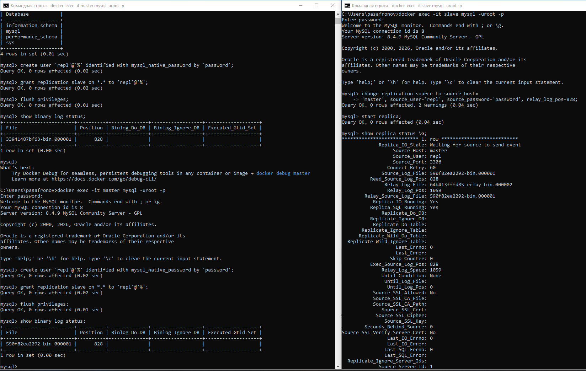
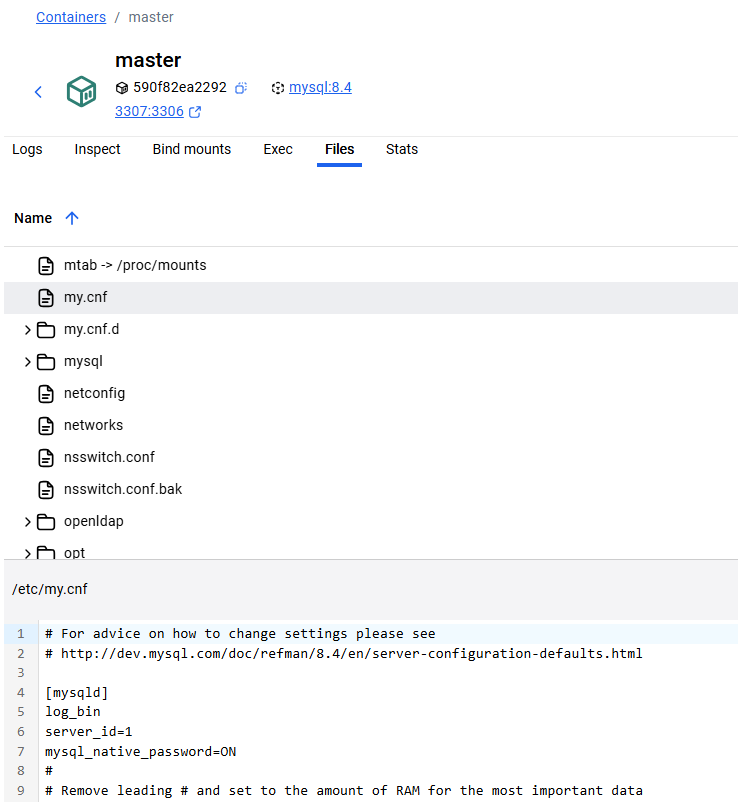
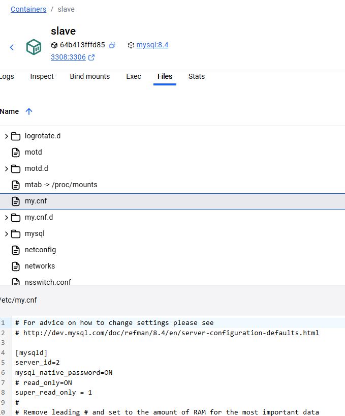
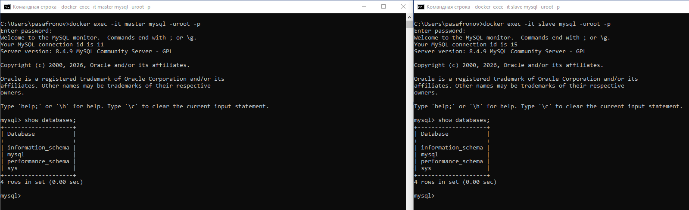
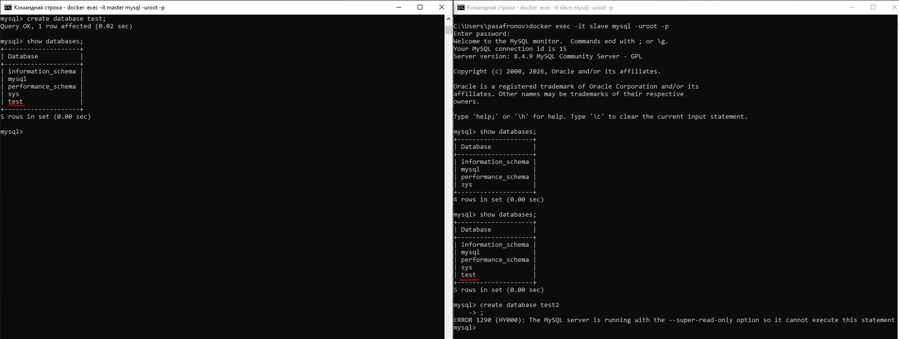

# Домашнее задание к занятию «Репликация и масштабирование. Часть 1» Сафронов П.А.


### Задание 1

На лекции рассматривались режимы репликации master-slave, master-master, опишите их различия.
```
В случае master-slave запись данных производится на один узел
и они реплицируются на второй (slave) узел,
т.е. при отказе master'а запись новых данных невозможна.

В случае master-master запись данных происходит на любой узел
и они появятся на втором (в случае если он работает штатно).
```
*Ответить в свободной форме.*

---

### Задание 2

Выполните конфигурацию master-slave репликации, примером можно пользоваться из лекции.











*Приложите скриншоты конфигурации, выполнения работы: состояния и режимы работы серверов.*
